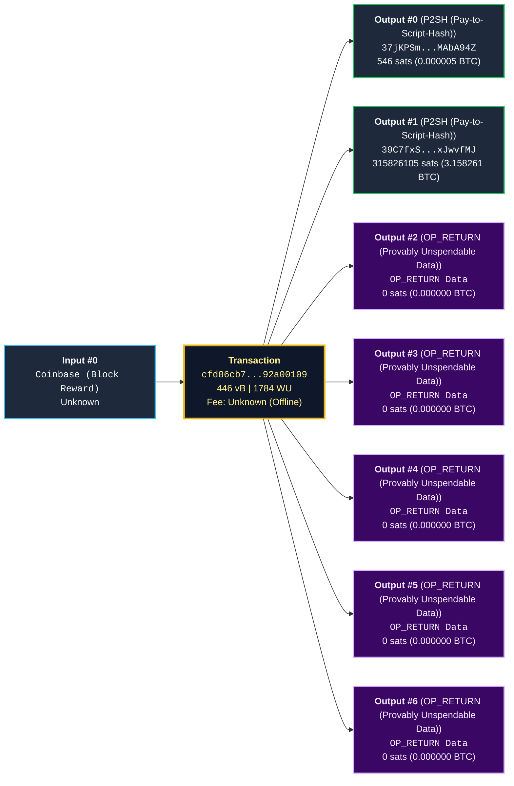

# Bitcoin Transaction Technical Report: `cfd86cb74df74ccd76b31621033b20abee860e720e66cef1febbde0c92a00109`

**Network**: bitcoin | **Classification**: Coinbase (Block Reward) | **Version**: 1

## 1. Executive Summary

| Metric | Value |
| :--- | :--- |
| **Txid** | `cfd86cb74df74ccd76b31621033b20abee860e720e66cef1febbde0c92a00109` |
| **Wtxid** | `5145808887ead4bed994176f3ae2f66c92dd75a552e3e40773960624432307cd` |
| **Virtual Size (vsize)** | 446 vB |
| **Weight Units (WU)** | 1784 WU |
| **Raw Serialized Size** | 473 bytes |
| **Witness Discount** | 5.7% |
| **SegWit Status** | Active (v0/v1) |
| **BIP125 RBF Signaling** | Coinbase |
| **Locktime Specification** | No locktime enforced (executable immediately in any block) |

## 2. Visual Transaction DAG

## 3. Inputs Breakdown

| # | Previous OutPoint | Value | Sequence | ScriptSig / Witness Details |
| :--- | :--- | :--- | :--- | :--- |
| 0 | Coinbase Generation | Unknown | `0xffffffff` | **ScriptSig**: `OP_PUSHBYTES_3 a2cd0e OP_PUSHBYTES_27 4d696e656420627920416e74506f6f6c39373115005b02457198fe OP_RETURN_250 OP_RETURN_190 OP_2DROP OP_2DROP OP_LSHIFT OP_RETURN_190 OP_VERNOTIF OP_BOOLAND INVALID_OPCODE` **Witness Items (1)**: - [0] *32-byte data element (SHA-256 hash preimage, Taproot x-only pubkey, or secret)*: `0000000000000000000000000000000000000000000000000000000000000000` |

## 4. Outputs Breakdown

| # | Value | Script Type | Address / Payload | ScriptPubKey Disassembly |
| :--- | :--- | :--- | :--- | :--- |
| 0 | 546 sats (0.000005 BTC) | P2SH (Pay-to-Script-Hash) | `37jKPSmbEGwgfacCr2nayn1wTaqMAbA94Z` | `OP_HASH160 OP_PUSHBYTES_20 42402a28dd61f2718a4b27ae72a4791d5bbdade7 OP_EQUAL` |
| 1 | 315826105 sats (3.158261 BTC) | P2SH (Pay-to-Script-Hash) | `39C7fxSzEACPjM78Z7xdPxhf7mKxJwvfMJ` | `OP_HASH160 OP_PUSHBYTES_20 5249bdf2c131d43995cff42e8feee293f79297a8 OP_EQUAL` |
| 2 | 0 sats (0.000000 BTC) | OP_RETURN (Provably Unspendable Data) | `UnknownProtocol("aa21a9ed6efcf98e0088ac0e423dbf4c3e76fdf292e6857edebb1aee844604a899789546")` | `OP_RETURN OP_PUSHBYTES_36 aa21a9ed6efcf98e0088ac0e423dbf4c3e76fdf292e6857edebb1aee844604a899789546` |
| 3 | 0 sats (0.000000 BTC) | OP_RETURN (Provably Unspendable Data) | `UnknownProtocol("434f5245012953559db5cc88ab20b1960faa9793803d0703374e3ecda72cb7961caa4b541b1e322bcfe0b5a030")` | `OP_RETURN OP_PUSHBYTES_45 434f5245012953559db5cc88ab20b1960faa9793803d0703374e3ecda72cb7961caa4b541b1e322bcfe0b5a030` |
| 4 | 0 sats (0.000000 BTC) | OP_RETURN (Provably Unspendable Data) | `UnknownProtocol("455853415401000d130f0e0e0b041f120013")` | `OP_RETURN OP_PUSHBYTES_18 455853415401000d130f0e0e0b041f120013` |
| 5 | 0 sats (0.000000 BTC) | OP_RETURN (Provably Unspendable Data) | `UnknownProtocol("737973d80fe57c3ccbe489863311370d30790e20a64dece1a42ec158b820296f90b4dae6692300")` | `OP_RETURN OP_PUSHBYTES_39 737973d80fe57c3ccbe489863311370d30790e20a64dece1a42ec158b820296f90b4dae6692300` |
| 6 | 0 sats (0.000000 BTC) | OP_RETURN (Provably Unspendable Data) | `Runes` | `OP_RETURN OP_PUSHBYTES_41 52534b424c4f434b3a33d09fa41711d29c1881139c87ab571b31c86f62057c31b53c15011c008dec63` |

